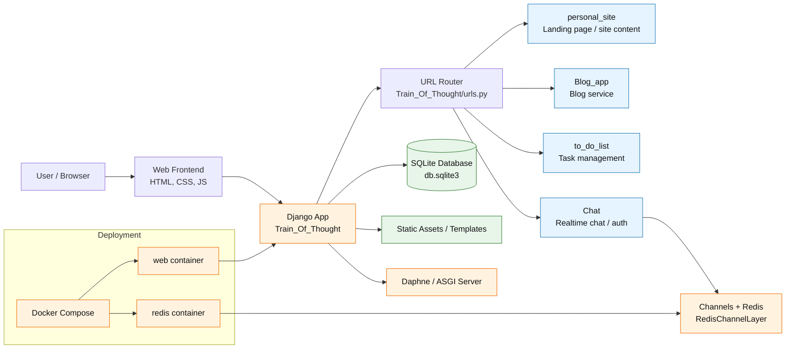

# Architecture Overview

This repository is a Django-based multi-app web platform that exposes several services through a single entrypoint. The core application is the `Train_Of_Thought` Django project, which routes traffic to feature apps, stores data in SQLite, and uses Redis for async messaging via Channels.

## Component Summary

- `personal_site`: main site pages and public landing experience.
- `Blog_app`: blog-related routes and functionality.
- `to_do_list`: task-list application.
- `Chat`: chat feature using Django Channels with custom user support.
- `Train_Of_Thought`: Django project settings, routing, and integration layer.
- `db.sqlite3`: primary application database for local persistence.
- `Redis`: message broker used by Channels for real-time communication.
- `Docker Compose`: containerizes the web app and Redis service.

## Runtime Flow

1. Requests arrive from the browser to the Django app.
2. The main URL router forwards requests to the correct app.
3. App-level views and templates render the requested page or service.
4. Data is persisted in SQLite.
5. Realtime chat traffic is mediated through Redis via Django Channels.
6. The app is deployed in Docker using a web container and Redis container.
